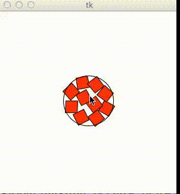

Packing
=======

How many squares can you fit in a circle?

-----------------------------------
The goal of this project is to find the minimum size circle into which you can pack n identical squares. This problem has only been solved for the case where n=1 and n=2. Erich Friedman's [website](http://www2.stetson.edu/~efriedma/squincir/) lists the best known results up to n=35. While is project will probably not find the absolute minimum radius for a given n, it will give a good approximation. Additionally, this approximation may be more useful in practical applications, as the procedure by which the blocks are packed is analogous to blocks tumbling around a circular container.

Specifically, this algorithm works by defining a potential between blocks and between each block and the containing circle. This potential is defined to be proportional to the overlap between the shapes. Thus, the goal is to achieve an alignment with a potential of zero. When this is not the case, each square translates and rotates in such a way as to minimize its local potential. The idea is that if the squares in one area are packed to closely, those squares will exert a "force" on outside squares to create more room. Thus, local contrains will propagate across the circle.

To help the blocks converge, the potential is defined to be porportional to the overlap up to a geometrically decreasing constant alpha. To prevent falling into local maxima, alpha occasional resets to a higher value. Also, a small random factor (also proportional to alpha) is added to the position and orientation of each block at each time step.

The algorithm is given a number of blocks, n, and a circle radius, r. If a valid configuration hasn't been found after a given number of steps, the program concludes that it is imposible to pack n blocks in a circle of radius r. Thus, to calculate the minimum radius, hold n constant and perform a binary search over r.

---------------------------------

Going forward there's still much room for improvement:

* The procedure for calculating overlap is only a weak approximation.
* There are many parameters that need to be set each time the program is run. It would be great to refine these.
* The procedure for calculating how much to rotate overlapping blocks is still fairly rough, and makes many geometric approximations.
* It also looks like we could implement some of the ideas from the [PackAnyShape Algorithm](http://www.pack-any-shape.com/) and achieve better results.
